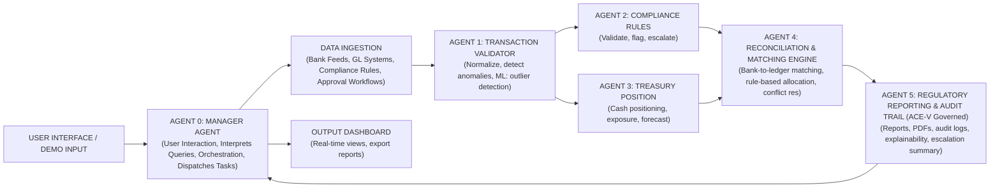

# CATAS Technical Architecture
## Multi-Agent System Design for Compliance & Treasury Automation

---

## System Architecture Overview



---

## Agent Definitions

### **Agent 0: Manager Agent**

**Responsibility:** Serve as the primary entry point for users, coordinate tasks between sub-agents, and aggregate final outputs.

**Inputs:**
- User queries (e.g., "Run reconciliation on latest bank feed")
- Sub-agent outputs (status, errors, completion summaries)

**Processing Logic:**
- Intercept user intent and dispatch structured commands to Agents 1-5.
- Monitor workflow execution (Agent 1 → Agent 2/3 → Agent 4 → Agent 5).
- Compile dashboard parameters and format human-readable summaries.
- **Output:** Orchestrated commands → All Sub-Agents; Summarized view → Output Dashboard.

---

### **Agent 1: Transaction Validator & Normalizer**

**Responsibility:** Ingest raw transactions, normalize across sources, detect anomalies.

**Inputs:**
- Bank feeds (Swift/ISO 20022, CSV, API)
- Internal transaction logs
- Prior month baseline data

**Processing Logic:**
```
FOR each transaction:
  1. Parse metadata (amount, counterparty, date, currency)
  2. Normalize: Convert all formats to ISO 20022 standard
  3. Deduplicate: Check if transaction already exists (by hash)
  4. ML: Anomaly detection
     - Train on 12-month historical data
     - Flag if: amount > 3σ from mean, unusual time pattern, new counterparty
  5. Output: Normalized transaction + risk flags
```

**ML Engineering:**
- **Model:** Isolation Forest (for multivariate anomaly detection) or Autoencoder
- **Features:** Amount, counterparty ID, transaction type, hour-of-day, day-of-week, currency, amount-to-average-ratio
- **Threshold:** Flag transactions where anomaly score > 0.7 (tunable)

**Output:** Structured transaction record (JSON) with anomaly flags → Agent 2 & 3

---

### **Agent 2: Compliance Rules Engine**

**Responsibility:** Apply regulatory and internal compliance rules, generate compliance signals.

**Inputs:**
- Normalized transactions from Agent 1
- Compliance rule database (XML/JSON config)
- Regulatory reference data (OFAC list, sanctions, blocked jurisdictions)
- Approval workflow definitions

**Processing Logic:**
```
FOR each normalized transaction:
  1. SANCTIONS CHECK: Does counterparty appear in OFAC/EU/UN lists?
     → If YES: Flag severity HIGH, escalate immediately
  2. TRANSACTION LIMITS: Apply per-counterparty, per-product limits
     → If exceeds limit: Create escalation ticket
  3. APPROVAL WORKFLOW: Does transaction exceed approval authority?
     → If YES: Check if approval already obtained from approver
     → If NO: Route to approver
  4. REGULATORY REPORTING: Does transaction trigger reporting requirement?
     → If trades over threshold: Mark for CAT, TRACE, or equivalent reporting
  5. ML: Pattern learning from compliance officer decisions
     → Learn: What percentage of escalations in this category are approved?
     → Score new transactions as "likely-approve" vs "likely-reject"
  6. Output: Compliance decision (APPROVE, ESCALATE, FLAG)
```

**ML Engineering:**
- **Model:** Logistic Regression or Gradient Boosting (classification)
- **Features:** Transaction type, amount-to-limit ratio, counterparty-risk-score, time-since-last-transaction, user-role, approval-history
- **Training:** Historical approvals/rejections from compliance officers
- **Output:** Confidence score (0-1) and suggested action

**Output:** Compliance decision record (with reasoning) → Agent 4 & 5

---

### **Agent 3: Treasurer Position & Risk Agent**

**Responsibility:** Compute cash position, liquidity, counterparty exposure, forecast cash flows.

**Inputs:**
- Normalized transactions from Agent 1
- GL balances (by account, currency, entity)
- FX rates (real-time or EoD)
- Funding agreements (credit lines, loan terms)
- Historical cash flows (12 months)

**Processing Logic:**
```
1. POSITION AGGREGATION:
   FOR each account:
     → Sum daily balance by currency, entity, product type
     → Cross-reference with GL for discrepancies
   OUTPUT: Position snapshot (currency, amount, last-update-time)

2. LIQUIDITY METRICS:
   → Cash coverage ratio = Total liquid assets / (Daily outflows × 5 days)
   → Reserve ratio = Available liquidity / Minimum regulatory reserve
   → Stress-test: What if largest counterparty default today?

3. COUNTERPARTY EXPOSURE:
   FOR each counterparty:
     → Sum all transactions (deposits, payments, investments)
     → Calculate % of total treasury portfolio
     → Identify concentration risk
   OUTPUT: Exposure report (counterparty, amount, % of total, risk-level)

4. CASH FLOW FORECAST (ML):
   → Input: Historical daily outflows, seasonal patterns, contract terms
   → Model: ARIMA or Prophet time-series
   → Forecast: Next 30 days' cash position
   → Output: Liquidity risk signals (if forecast < minimum reserve, flag)

5. SCENARIO ANALYSIS:
   → If interest rates rise 1%? 2%? 5%?
   → If largest counterparty fails?
   → If FX moves 10%?
   → Output: Risk scenarios + recommended mitigation
```

**ML Engineering:**
- **Time-Series Forecasting:** ARIMA(p,d,q) or Prophet for cash flow
- **Risk Scoring:** Heuristic (exposure %, concentration %, credit rating) or ML ensemble
- **Stress Testing:** Scenario simulation engine

**Output:** Position dashboard, liquidity forecast, risk metrics → Agent 4 & 5

---

### **Agent 4: Reconciliation & Matching Engine**

**Responsibility:** Bank-to-ledger matching, exception handling, conflict resolution.

**Inputs:**
- Bank transactions (from Agent 1)
- GL ledger entries (from internal system)
- Compliance decisions (from Agent 2)
- Liquidity constraints (from Agent 3)
- Match rules (configurable)

**Processing Logic:**
```
1. TRANSACTION MATCHING:
   FOR each bank transaction:
     → Search GL for matching amount ± tolerance (default ±$0.01)
     → Match on: amount, date (±2 days), counterparty, reference field
     → ML: Confidence scoring if multiple candidates
   OUTPUT: Matched pairs or UNMATCHED list

2. UNMATCHED RESOLUTION:
   FOR each unmatched transaction:
     a) Check if GL entry exists but with timing difference
        → Mark as TIMING_DIFFERENCE (typical for checks, ACH)
     b) Check if duplicate in bank feed
        → Mark as DUPLICATE
     c) Check if fraudulent (ML anomaly score HIGH + compliance flag)
        → Route to compliance team
     d) If outstanding (old transaction, no GL match)
        → Create reconciling entry or escalate

3. EXCEPTION HANDLING:
   FOR each unmatched/unreconciled:
     → Assign to queuer based on:
        - Amount (> $10K → CFO review)
        - Age (> 10 days → escalate)
        - Counterparty risk (high-risk → compliance)
   OUTPUT: Escalation queue

4. AUDIT TRAIL RECORDING:
   FOR each decision:
     → Log: transaction ID, match type, confidence, who matched, when
     → Store: Original transaction, matched GL entry, decision reasoning
   OUTPUT: Audit log (immutable)
```

**ML Engineering:**
- **String Matching:** Fuzzy matching (Levenshtein distance) for counterparty names
- **Confidence Scoring:** Logistic regression on match quality (amount, date, reference similarity)
- **Auto-categorization:** If GL code missing, ML suggests GL account (based on transaction type, counterparty)

**Output:** Reconciliation report (matched %, unmatched items, escalations) → Agent 5

---

### **Agent 5: Regulatory Reporting & Audit Trail Manager**

**Responsibility:** Generate compliant reports, maintain immutable audit logs, manage escalations.

**Inputs:**
- All decisions from Agents 1-4
- Regulatory reporting requirements (jurisdiction-based)
- Audit trail store (immutable log)
- Report templates

**Processing Logic:**
```
1. AUDIT TRAIL GENERATION (ACE-V Governance):
   FOR each transaction decision:
     → Who: User role, approver ID
     → What: Transaction ID, action taken (approved/escalated/flagged)
     → When: Timestamp (UTC)
     → Why: Compliance rule triggered, ML confidence, exception reason
     → Where: System, module, version
   OUTPUT: Audit trail entry (JSON) + timestamp proof

2. REGULATORY REPORT GENERATION:
   FOR each jurisdiction (US, EU, UK, other):
     → Identify reportable transactions (CAT, TRACE, FinCEN, etc.)
     → Validate data completeness (all required fields present)
     → Format per regulator requirements (XML for CAT, JSON for FinCEN)
     → Add certification signature
   OUTPUT: Regulatory submission file

3. EXCEPTION REPORT:
   FOR each escalated/flagged item:
     → Summarize reason (compliance rule triggered, amount threshold, ML anomaly)
     → Show recommended action
     → List approvers required
   OUTPUT: Exception queue (dashboard + email)

4. AUDIT REPORT GENERATION:
   → Export full transaction history (with all agent decisions)
   → Include: Original transaction, validation result, compliance check, match result, approval status
   → Add audit trail chain (who looked at what, when)
   OUTPUT: PDF (audit-ready)

5. ACE-V EXPLAINABILITY:
   FOR each flagged/escalated decision:
     → Provide reasoning: "Transaction flagged because: (A) amount > $100K (Agent 1 anomaly), 
       (C) counterparty on OFAC watch list (Agent 2 compliance), (E) 2-day delay from bank 
       (Agent 4 reconciliation). Recommendation: Review OFAC status before approval."
```

**Output:** Regulatory reports, audit trails, exception queue, explainable decisions → Dashboard

---

## Data Schema (MVP)

### **Transaction Record**
```json
{
  "transaction_id": "TXN-2025-001234",
  "bank_date": "2025-05-15",
  "gl_date": "2025-05-15",
  "amount": 250000.00,
  "currency": "USD",
  "counterparty_name": "Acme Corp LLC",
  "counterparty_id": "CP-0056789",
  "transaction_type": "wire_payment",
  "reference": "Invoice #12345",
  "source_system": "bank_feed",
  "agent_1_anomaly_score": 0.65,
  "agent_2_compliance_status": "ESCALATE",
  "agent_2_compliance_reason": "amount_exceeds_daily_limit",
  "agent_2_ml_confidence": 0.89,
  "agent_3_exposure_impact": "counterparty_exposure_now_at_18%",
  "agent_4_match_status": "MATCHED",
  "agent_4_match_confidence": 0.98,
  "agent_5_audit_trail": [
    {"timestamp": "2025-05-15T14:22:30Z", "agent": "Agent1", "action": "validated", "confidence": 0.65},
    {"timestamp": "2025-05-15T14:23:15Z", "agent": "Agent2", "action": "flagged_OFAC", "confidence": 0.95}
  ],
  "final_status": "PENDING_APPROVAL",
  "approver_required": ["CFO", "Compliance Officer"]
}
```

---

## ML Models Summary (for Hackathon)

| Agent | Model Type | Input Features | Output | Training Data Source |
|-------|-----------|---|---|---|
| Agent 1 | Isolation Forest | amount, counterparty, txn_type, hour, day, currency, ratio | Anomaly score (0-1) | 12-month transaction history |
| Agent 2 | Logistic Regression | txn_type, amount_ratio, cp_risk, days_since_last, user_role, approval_history | Approval likelihood (0-1) | Historical compliance decisions |
| Agent 3 | ARIMA/Prophet | Daily outflows, seasonal, contract_terms | 30-day cash forecast | 12-month GL history |
| Agent 3 | Risk Ensemble | exposure%, concentration%, credit_rating | Risk score (0-1) | Regulatory data + internal portfolio |
| Agent 4 | Fuzzy Match + LR | amount_match, date_match, ref_similarity | Match confidence (0-1) | Historical reconciliation matches |

---

## Hackathon MVP Scope

### **Data:**
- 100 sample bank transactions (5 currencies, 10 counterparties, 3 entities)
- 50 GL entries (matching subset of bank transactions)
- 5 compliance rules (OFAC, daily limits, approval workflows, reportable trades, high-risk counterparties)
- 12-month historical transaction baseline (for ML training)

### **Agents (Fully Functional):**
1. ✅ Agent 1: Transaction validation + anomaly detection
2. ✅ Agent 2: Compliance rule engine + ML confidence scoring
3. ✅ Agent 3: Position aggregation + basic liquidity forecast
4. ✅ Agent 4: Bank-to-ledger matching + exception handling
5. ✅ Agent 5: Audit trail + compliance report generation

### **UI/Dashboard:**
- Transaction intake form (bank feed upload)
- Real-time reconciliation status (matched %, unmatched count)
- Compliance exception queue (flagged items, approvers needed)
- Audit trail viewer (transaction history + all agent decisions)
- Report export (PDF compliance report)

### **Deliverables:**
1. **Technical Architecture Doc** (this document)
2. **Lyzr Architect Blueprint** (6 agents including Manager Agent, orchestration config)
3. **Live Demo** (100 transactions → reconciled in <5 min, showing audit trail)
4. **Talking Points** (No slide decks permitted - problem, solution, impact points for demo)

---

## Success Metrics

| Metric | Target | Method |
|--------|--------|--------|
| **Reconciliation Speed** | <5 min for 100 txns | Time Agent 4 end-to-end |
| **Match Rate** | >95% auto-match | Count matched / total |
| **Compliance Coverage** | 5+ rules applied | Count rules triggered |
| **Anomaly Detection** | >80% precision | Manual review of flagged items |
| **Audit Trail Completeness** | 100% transaction coverage | Verify every transaction has audit log |
| **Explainability** | Every flagged decision has reasoning | Check Agent 5 output |

---

## Technologies & Tools

- **Lyzr Architect:** Multi-agent orchestration, low-code UI generation
- **ML Libraries:** scikit-learn (Isolation Forest, LR), statsmodels/Prophet (forecasting)
- **Data:** Pandas (transformation), SQLite or in-memory (storage for hackathon)
- **APIs:** Lyzr platform, open-source OFAC list APIs (if integrating)
- **Report Generation:** Jinja2 (templating), PDF export library

---

## Post-Hackathon Roadmap

### **Phase 2: Expand Coverage**
- Real bank APIs (Plaid, Teller, FDX)
- GL system connectors (NetSuite, QuickBooks, SAP)
- Multi-currency exposure tracking
- Interest rate risk modeling

### **Phase 3: Advanced ML**
- Deep learning for transaction classification (RNN for sequences)
- Fraud detection ensemble (combine multiple anomaly detectors)
- Regulatory rule inference (learn rules from compliance officer patterns)
- Natural language processing for approval comments

### **Phase 4: Enterprise Scale**
- Kubernetes deployment (multi-tenant)
- Real-time streaming (Kafka for high-volume banks)
- Advanced ACE-V governance (agent voting, consensus mechanisms)
- Integration with SWIFT, ISO 20022 standardization

