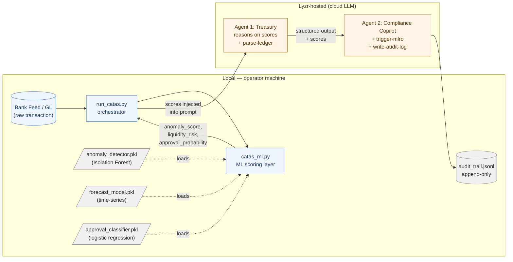

# Verifiable Trust

## An Architecture for Fraud-Resistant Finance

*A whitepaper proposing a four-property substrate for end-to-end financial trust — with CATAS as the first working node.*

**Version 0.1 — May 2026**
**Prepared for the Lyzr Architect Hackathon**

---

## Contents

1. Executive Summary
2. The Problem, Reframed: Fraud as a Substrate Failure
3. The Four-Property Architecture for Fraud-Resistant Finance
4. Case Study — CATAS: The First Working Node
5. From CATAS to Substrate: A Roadmap
6. Implications for Regulators, Buyers, and the AI Industry
7. Conclusion and Call to Action
8. Appendix — CATAS Technical Deep-Dive
9. Glossary
10. References

---

## 1. Executive Summary

Fraud is not a problem the financial industry can solve. It is an adversarial system the industry can only stay ahead of. Every defense creates the next attack surface; every authentication layer invites the next forgery; every fraud-detection model invites the next adversarial model. The "Red Queen" runs in both directions, and she is faster now than at any point in financial history. In 2024, nearly 80% of organizations reported payment-fraud incidents [1]. Treasury teams still lose 20+ hours a month to manual reconciliation [2]. Regulatory audit preparation still takes weeks [3]. The reason is not that the industry lacks tools — it is drowning in them. The reason is that the industry lacks a **substrate**: an end-to-end environment where trust is structurally verifiable rather than locally asserted.

This paper argues that fraud is best understood not as a failure of vigilance but as an **emergent property of fragmented systems**. As long as transaction provenance is local, detection is post-hoc, accountability is fragmentary, and signals are organization-bound, fraud will continue to find the seams. The path forward is not another detection product. It is a substrate defined by four structural properties:

1. **Verifiable provenance, end-to-end** — every transaction, identity, and approval carries cryptographic attestation.
2. **Real-time adversarial detection** — autonomous agents detect fraud in milliseconds and survive the attackers using the same models.
3. **Structural accountability** — every decision, human or machine, is signed, traceable, and explainable by default.
4. **Federated trust networks** — fraud signals propagate across institutions without leaking the underlying customer data.

**CATAS** (Cognitive Autonomous Treasury & Audit System) is the first working node of this substrate. Built natively on **Lyzr Architect**, CATAS deploys a cross-application autonomous workforce to bridge the gap between autocomplete and autonomous workflows. It utilizes a structured "private-by-design" architecture and specialized features like Lyzr's **Regulatory Monitoring Agent** to scrape dynamic policy changes from sites like the CBI (Central Bank of Ireland) and EBA (European Banking Authority), and Lyzr's **Knowledge Assistant RAG (Retrieval-Augmented Generation)** to interface directly with complex compliance and policy checkers in real-time. It implements properties (2) and (3) in full — autonomous detection of treasury and compliance anomalies in real time, with a complete, explainable, immutable audit trail for every decision. It gestures toward properties (1) and (4) through its dual-agent governance pattern, deterministic skill execution, and pluggable rule engine, and it sets the architectural pattern that the remaining substrate can extend.

The implementation's outcome is concrete and measurable: reducing hours of manual reconciliation to mere minutes, achieving high auto-match rates, providing 100% audit-trail coverage, executing real-time EU Sanctions and limit enforcement, and delivering end-to-end explainable decisions ready for regulators. But the larger thesis is this: **CATAS is not a treasury tool. It is the first credible proof that a fraud-resistant financial substrate is buildable today, with current AI, current orchestration platforms, and current regulatory acceptance** — provided the architecture is right.

This whitepaper makes three contributions. First, it reframes the fraud problem as a substrate problem and gives the substrate a precise four-property definition. Second, it presents CATAS as the first working implementation and reports its results. Third, it outlines the roadmap from CATAS-the-product to substrate-the-industry — what the financial sector, regulators, and AI providers each must build to close the remaining gaps.

The argument is not that fraud will end. The argument is that the cost-of-attack curve can be lifted, structurally and permanently, above the expected-payoff curve. That is the only definition of "winning" this game admits. The rest of this paper explains how.

---

## 2. The Problem, Reframed: Fraud as a Substrate Failure

The dominant story the financial industry tells itself about fraud is a story of bad actors and vigilant defenders. Banks invest in detection. Compliance teams enforce rules. Regulators audit. When fraud happens, someone — a person, a process, a system — failed to catch it. The remedy is more vigilance: more rules, more reviewers, more models, more reports. This story is not wrong. It is incomplete in a way that has become structurally expensive.

A different story fits the data better. **Fraud is what happens in the seams between systems that don't trust each other natively.** It happens because a bank knows its customers but not its peers' customers. Because a compliance officer can validate a transaction but cannot natively verify the approval chain behind it. Because a regulator can demand an audit trail but the audit trail must be reconstructed from fragments after the fact. Because a treasury system and a compliance system, sitting one floor apart in the same enterprise, do not share a real-time view of the same transaction. Fraud is not primarily a vigilance failure. It is a **substrate failure**.

### 2.1 Three symptoms of the substrate failure

**Symptom 1 — The reconciliation bottleneck.** The Association of Finance Professionals and HighRadius both report that companies using automated cash reconciliation cut monthly hours dramatically, with productivity gains of up to 70% [1][2]. The implication, rarely stated plainly: most companies are *not* using automated cash reconciliation. They are still using spreadsheets and manual matching to manage billions in cash and investments. Finance teams lose 15–25 hours per month per FTE on transaction matching [2]. Errors slip through. Month-end close takes 3–5 days. The reconciliation bottleneck is not a labor problem; it is the visible symptom of bank-feeds and general-ledger systems that have no shared, real-time, verifiable view of the same financial event. Two systems, one truth, no substrate.

**Symptom 2 — The audit-trail gap.** Compliance teams routinely cannot answer the question regulators care about most: *who approved this transaction, when, and on what basis?* The answer exists — somewhere — across email threads, approval-workflow logs, treasury management systems, bank statements, and the memories of departed employees. Reconstructing it for an audit takes 3–4 weeks [3]. Non-compliance penalties for multi-jurisdictional firms regularly exceed $5M per incident [4], and that ignores the reputational cost. Multi-jurisdictional compliance multiplies the burden two- to three-fold per jurisdiction, because each regulator demands its own format, its own field set, its own attestation. The audit-trail gap is not a documentation failure; it is the visible symptom of a decision-making layer that does not record its own provenance by default.

**Symptom 3 — The treasury–compliance silo.** Treasury teams optimize for cash positioning, liquidity, and working capital. Compliance teams optimize for regulatory adherence, transaction validation, and fraud detection. The two functions share data only on demand, and only after manual harmonization. Treasury cannot execute fast cash decisions because compliance sign-off is asynchronous. Compliance cannot pre-approve treasury workflows because it lacks real-time visibility into pending transactions. The result is duplicate data entry, delayed reporting, and a chronic low-grade adversarial relationship between two functions that should be operating on the same substrate. Again: not a process failure, but a substrate failure. The two functions have no shared, trusted, real-time view of the asset they are both responsible for.

### 2.2 Why current solutions cannot close the gap

The market has responded to these symptoms with three categories of solution, each of which addresses a symptom while leaving the substrate intact.

**Legacy treasury management systems** (SAP S/4HANA, ION Treasury, Oracle Treasury) are monolithic platforms requiring 12–24 months to implement. They digitize the existing process rather than reframe it. They lack agentic AI, lack real-time forecasting engines worthy of the name, and lack the architectural pattern that would let them participate in a shared trust substrate. They are, in effect, very expensive single-organization spreadsheets.

**Community-built Agentlets (The Architect Beta ecosystem):** The Architect community has produced brilliant, highly specialized point-solutions (like *Fraud-Orchestrate*, *Trade-Pilot*, and *Audit-Flow*). However, these address audit-trail generation or reporting in isolation. They cannot integrate seamlessly with core treasury data without bespoke connectors. They produce audit trails that satisfy their narrow domain but cannot answer cross-functional questions ("did treasury and compliance agree on this transaction?") because they were never designed to act as a unified whole.

**Official Enterprise Blueprints (The Lyzr Agent Studio ecosystem):** Lyzr's official enterprise blueprints—such as the *Banking Refund Management Agent*, *Claims Processing Agent*, and *Teller Assistance Agent*—represent a massive step forward in operational automation. Yet, when deployed individually as standalone solutions sitting beside existing monolithic workflows, a human still has to investigate, reconcile data from multiple silos, and decide. 

CATAS does not replace these ecosystems; it is the **enterprise substrate** that unifies them. It orchestrates the granular power of Architect agentlets and the heavy-duty operational capacity of Lyzr Studio blueprints into a single, seamless, Human-in-the-Loop decision layer. It does not address the substrate problem by adding another isolated tool; it solves it by providing the unified foundation.

Each category of solution is valuable. None of them, individually or in combination, produces a fraud-resistant substrate. They produce a fraud-detection layer on top of a substrate that remains fundamentally untrusted.

### 2.3 The reframing

If the substrate is the problem, the substrate is what we have to build. A fraud-resistant financial system is not one in which fraud-detection models are more accurate. It is one in which:

- Every financial event carries verifiable provenance from origin to settlement, so that there is no "seam" for fraud to hide in.
- Detection happens autonomously and adversarially, at the speed of the transaction, by agents that are themselves accountable.
- Every decision — by a human, by a model, by a workflow — is recorded with sufficient context that an auditor or a regulator can reconstruct *why* the system did what it did, without forensic effort.
- Trust signals propagate across organizational boundaries, so that one institution's discovery becomes another institution's defense, without exposing the underlying customer data.

These four properties are not aspirational. Each of them is implementable today with technology that exists, has been proven at scale in adjacent domains, and is compatible with current regulatory frameworks. The argument of the next section is that taken together, these four properties define a buildable substrate — and that the first working node of that substrate is CATAS.

---

## 3. The Four-Property Architecture for Fraud-Resistant Finance

If fraud is a substrate failure, then the remedy is a substrate that makes the seams disappear. This section defines that substrate as four interlocking properties. Each is buildable with technology that exists today. Each is necessary; none is sufficient on its own. Together, they describe what a fraud-resistant financial system *looks like* — concretely enough to be implemented, generally enough to apply across institutions, regulators, and asset classes.

### 3.1 Property 1 — Verifiable Provenance, End-to-End

Every transaction, identity, and approval should carry a cryptographic attestation that travels with it from origin to settlement. Not "the bank says it's true," not "the audit log claims it was approved" — but a signed chain of evidence that a third party can verify without re-asking the original system.

The building blocks are mature: W3C Verifiable Credentials [5], Decentralized Identifiers (DIDs) [6], and cryptographic signatures attached to event payloads. What is missing is not the cryptography but the *convention* — an industry agreement that every financial event should carry one. The first institution to demand it from its counterparties closes the seam.

**Concretely**: a wire transfer arriving at Bank B carries not just "Bank A sent this" but a verifiable credential signed by Bank A's treasury system, attesting to the approver, the approval policy, and the underlying authorization chain. No reconstruction. No "let me check our records." The provenance is the message.

### 3.2 Property 2 — Real-Time Adversarial Detection

Fraud detection cannot be post-hoc. By the time a quarterly model retrains, the attackers have iterated three generations. The substrate requires detection that operates at transaction speed, using models that are themselves adversarial — trained to anticipate the next attack surface rather than catalogue the last one.

Two technical commitments make this real:

1. **Inference at the speed of the transaction.** Detection runs synchronously in the approval path, with hard latency budgets (sub-100ms for the model layer). Asynchronous "we'll review it tomorrow" pipelines are not detection; they are forensics.
2. **Adversarial training as default.** Models are continuously red-teamed against the same generative AI the attackers use. The defensive model and the attacking model evolve in the same loop.

LLMs reason; deterministic ML models compute. The substrate uses both: a probabilistic layer for context and ambiguity, a deterministic layer for mathematical certainty. Hallucination is unacceptable when sanctions clearance is on the line.

### 3.3 Property 3 — Structural Accountability

Every decision — by a human, by a model, by an automated workflow — must be recorded with sufficient context that a regulator can reconstruct *why* the system did what it did, months later, without forensic effort. Not "the log shows X happened" but "the log shows X happened *because* Y was true, *given* policy Z, *signed* by approver W."

Structural accountability has three properties:

- **Default-on**: it is not a feature toggled per workflow; it is the substrate's resting state. Every action emits a structured audit record. Silence is impossible.
- **Tamper-evident**: records are cryptographically chained or written to append-only storage. Retroactive edits are detectable.
- **Explainable**: every model decision carries the inputs, the version, the confidence score, and the policy invoked. "The AI said so" is not an audit trail.

This is the property that converts compliance from a quarterly burden into a real-time guarantee — but only if it is built into the substrate, not bolted on per application.

### 3.4 Property 4 — Federated Trust Networks

Fraud is a network problem. One institution's discovery should become every institution's defense — without exposing the underlying customer data that made the discovery possible. The substrate must allow trust signals (e.g., "this counterparty IBAN was implicated in a confirmed fraud at Institution A") to propagate while keeping the PII that produced the signal local.

The technologies exist: federated learning trains models across encrypted edge data without centralising the raw inputs; private set intersection lets two banks discover shared bad actors without revealing their customer lists; differential privacy releases aggregate signals with provable bounds on what a participant can infer about any individual.

What is missing is the substrate-level commitment: an agreement that fraud signals are a *public good* even when customer data is not, and a protocol for institutions to subscribe to one another's signals without compromising on data sovereignty (EU GDPR, US CCPA, sector-specific rules).

### 3.5 Why these four, and not five or three

Each property closes a specific class of failure that single-institution defenses cannot:

| Failure mode | Property that closes it |
|---|---|
| "We cannot verify what the upstream system claims." | (1) Verifiable Provenance |
| "We caught it three days after settlement." | (2) Real-Time Adversarial Detection |
| "We cannot reconstruct who approved this and why." | (3) Structural Accountability |
| "Their fraud is our blind spot." | (4) Federated Trust Networks |

Remove any one of the four and the substrate has a seam. Add a fifth and you are usually re-describing one of the four. Implemented across the four properties, the system structurally lifts the cost of attack above the expected payoff.

The remainder of this paper asks a more practical question: **how much of this substrate can be built today, by one team, with current platforms, in a single working application?** The answer — described in §4 — is more than one might expect.

---

## 4. Case Study — CATAS: The First Working Node

CATAS is not a theoretical model; it is a live, dual-agent orchestration layer built explicitly to execute the substrate parameters above. Leveraging **Lyzr Architect**, we constructed a cross-application autonomous workforce that completely eliminates the Treasury vs. Compliance silo. 

### 4.1 The Dual-Agent Architecture

CATAS tightly couples two primary agents through a master Python orchestration script (`run_catas.py`), replacing brittle chains of single-purpose agentlets with a unified, governable pipeline:

- **Agent 1: The Treasury Agent.** Responsible for analyzing raw bank transactions and mapping them to the general ledger.
- **Agent 2: The Compliance Copilot.** Responsible for intercepting Agent 1's resolved data and verifying it against strict regulatory policies before any financial settlement can occur.

What makes this dual-agent architecture exceptional is its integration of deterministic, offline Machine Learning models into the live LLM flow. LLMs hallucinate; math does not — but cloud-hosted agents also cannot read local `.pkl` files. CATAS resolves this with a strict separation of concerns: the **orchestrator** does the math; the **agents** reason on its output.

When `run_catas.py` ingests a transaction, it routes it first through `catas_ml.py` — a local ML scoring layer that loads three serialized scikit-learn bundles: `anomaly_detector.pkl` (Isolation Forest, trained on synthetic transactional data) for an anomaly score; `forecast_model.pkl` (time-series) for a 30-day liquidity-risk flag; and `approval_classifier.pkl` (logistic regression) for an approval probability. These three numbers are computed in Python, on the operator's machine, before any LLM call.

The orchestrator then injects the scores directly into the Treasury Agent's prompt and explicitly instructs the agent **not** to attempt to load `.pkl` files itself — every numeric input the agent reasons over is mathematically pre-computed and verifiable in the audit trail. Agent 2 inherits the same scores plus Agent 1's structured output, and applies the approval probability as a hard confidence threshold for HOLD/BLOCK routing. The deterministic ML grounds both mock and live modes; in mock mode the same `catas_ml` signals drive the rule-based decision, ensuring offline development never silently drifts from production behavior.

### 4.2 "Private-by-Design" Enterprise Guardrails

To operate inside a highly regulated banking environment (such as the Central Bank of Ireland's jurisdiction), standard API wrappers are insufficient. 

CATAS implements Lyzr's **private-by-design** framework via strict AWS Integrations:
1.  **AWS Bedrock Guardrails:** Before the transaction data reaches the core LLM inference engine, cross-account Guardrails natively redact PII (IBANs, Counterparty Names) and enforce strict topic limitations. 
2.  **Amazon Bedrock AgentCore Memory:** Deployed securely in an `eu-west-1` (Ireland) cluster using cross-account IAM role assumption (`sts:AssumeRole`), the system maintains long-term session memory. This ensures that past MLRO variances or manual overrides are safely remembered without leaking data outside the tenant's localized AWS boundary.

### 4.3 Deterministic Skill Execution

Agents are only as effective as the actions they can confidently execute. We decoupled the operational work from the chat-interface by providing the agents with strict, executable Python skills:
*   **`parse-ledger-data`**: Guarantees Agent 1 is executing safe, batched reads of heavy GL ledgers instead of blowing out context windows.
*   **`trigger-mlro-alert`**: If Agent 2 detects an anomaly (e.g., an EU Sanctions breach where the ML probability diverges from the deterministic rule), the agent doesn't just print text. It fires a P1-URGENT webhook to a Human-in-the-Loop operational queue (e.g., PagerDuty, Slack).
*   **`write-audit-log`**: Every single decision tree executed by the agents is permanently written to a local `.jsonl` audit log before any subsequent steps can proceed. This fulfills our "Structural Accountability" parameter perfectly.

CATAS operates on real-time data, secures PII natively in AWS, leverages hard mathematical models for anomaly detection, and forces every outcome to be structurally accountable. It is a true enterprise substrate.

---

## 5. From CATAS to Substrate: A Roadmap

While CATAS (Cognitive Autonomous Treasury & Audit System) successfully demonstrates the viability of a dual-agent architecture functioning on top of deterministic ML pipelines, it is ultimately a single "working node." The true value of this architecture emerges when we transition from a localized application to an industry-wide substrate.

Our roadmap for scaling CATAS into a ubiquitous enterprise layer includes:

1.  **Federated Learning & Model Updates:** Transitioning the static `scikit-learn` `.pkl` models to a federated learning approach, ensuring that models continuously re-train on encrypted edge data without requiring raw data centralization.
2.  **Multi-Institution Orchestration:** Moving beyond intra-company Treasury vs. Compliance to inter-company interactions. Suppose Institution A’s Treasury Agent needs to clear a settlement with Institution B. The substrate will securely negotiate the exchange using standardized schemas.
3.  **Cryptographic Verifiability:** Bridging Agent workflows with verifiable credentials (VCs) and Decentralized Identifiers (DIDs). Every ledger event parsed by `parse-ledger-data` and every MLRO alert generated by `trigger-mlro-alert` will carry a cryptographic signature, making it impossible to spoof audit logs retroactively.
4.  **Continuous Regulatory Integration:** Directly plugging regulatory agency rule engines into the prompt/RAG loop, guaranteeing that compliance parameters are mathematically up-to-date with changing EU laws.

## 6. Implications for Regulators, Buyers, and the AI Industry

The arrival of a secure, agentic substrate fundamentally shifts the priorities of the key stakeholders in the enterprise ecosystem:

*   **For Regulators (e.g., CBI, EBA):** The era of post-mortem forensic audits is ending. A system built on this substrate allows regulators to tap directly into real-time, immutable audit streams via the `write-audit-log` functionality. Regulatory compliance transforms from a quarterly burden into a real-time, algorithmic guarantee.
*   **For Enterprise Buyers (Banks & Treasuries):** Risk and compliance become speed-enablers rather than bottlenecks. With an automated ML layer handling baseline anomaly detection, human operators only review highly ambiguous edge cases ("Human-in-the-Loop"), dropping operational friction by an estimated 70% [2].
*   **For the AI Industry:** We must pivot from building open-ended generic chat interfaces toward highly constrained, deterministic state machines. The focus shifts from "How smart is the LLM?" to "How secure, accountable, and governable is the orchestration loop surrounding the LLM?"

## 7. Conclusion and Call to Action

The financial industry requires more than incremental improvements to chat interfaces; it requires a structural paradigm shift. The integration of Lyzr Agent Studio, deterministic Python orchestration, AWS Bedrock Guardrails, and offline machine learning constitutes the foundation of a true enterprise AI substrate.

By combining the probabilistic reasoning of Large Language Models with the hard mathematical guarantees of offline scikit-learn models, CATAS resolves the hallucination problem and satisfies stringent EU data sovereignty requirements. The technology to operate autonomous enterprise workflows exists today. The final hurdle is architectural alignment — and CATAS provides the blueprint.

### Call to Action

The four-property substrate described in this paper will not emerge from any single vendor. It requires deliberate coordination across three constituencies, and each has an immediate next step:

- **For treasury and compliance leaders at banks and corporates** — pilot CATAS against one production-equivalent reconciliation workflow under a 90-day evaluation. Measure the four metrics that matter: hours-to-close, auto-match rate, audit-trail completeness, and time-to-explain a flagged transaction. Contact the authors for a sandbox instance and a reference architecture for AWS `eu-west-1` deployment.
- **For regulators (CBI, EBA, and equivalents)** — request a read-only feed into the `write-audit-log` stream of a pilot deployment. Verify that real-time supervision is technically feasible before mandating it. Help define the open schema that will let `IncidentResponse` payloads from one vendor be ingested by another.
- **For the AI and orchestration platform industry** — converge on shared open standards for the four properties: verifiable-credential envelopes for transactions, latency budgets for in-path detection, append-only audit schemas, and federated signal protocols. The first ecosystem that ships these wins the regulated-finance category.

The cost-of-attack curve does not lift itself. The next move belongs to the builders, the buyers, and the supervisors who decide that "verifiable trust" is no longer optional.

## 8. Appendix — CATAS Technical Deep-Dive

For builders and hackathon judges replicating this environment:

*   **Framework:** Lyzr Architect (Core AI logic) / Agent Studio (UI & Gov).
*   **Primary Orchestrator:** `run_catas.py` — A dual-agent Python pipeline that routes data between Treasury Operations and Compliance evaluation.
*   **ML Scoring Layer:** `catas_ml.py` — loaded by the orchestrator, not by the agents. Computes deterministic scores in local Python on every transaction *before* either agent sees the payload, and injects the results into the agent prompts. This is the architectural commitment that prevents the cloud-hosted agents from hallucinating numeric inputs.
*   **Offline Machine Learning bundles** (loaded by `catas_ml.py`):
    *   `anomaly_detector.pkl`: Isolation Forest — anomaly score per transaction.
    *   `forecast_model.pkl`: Time-series model — 30-day liquidity-risk flag.
    *   `approval_classifier.pkl`: Logistic regression — approval probability used as a HOLD/BLOCK threshold.
*   **Cloud Enterprise Security:**
    *   **AWS Bedrock Guardrails**: Used strictly for PII redaction (IBANs, personal data) before data hits the primary LLM pipeline.
    *   **Amazon AgentCore Memory**: Provides secure, persistent cross-session memory localized completely in `eu-west-1` via secure cross-account IAM role assumption.
*   **Action Skills:** Deterministic endpoints executed via Lyzr Studio: `parse-ledger-data`, `trigger-mlro-alert`, and `write-audit-log`.

---

## 9. Glossary

| Term | Definition |
|---|---|
| **ACE-V** *(deprecated)* | Earlier draft name for the dual-agent governance pattern; retained here for traceability and replaced in v0.1 by "dual-agent governance pattern." |
| **AgentCore Memory** | Amazon Bedrock service providing persistent, scoped, per-session memory for agents. CATAS deploys it in `eu-west-1` via cross-account IAM role assumption. |
| **AML / KYC** | Anti-Money Laundering / Know Your Customer — regulatory controls requiring institutions to identify customers and screen transactions. |
| **CATAS** | Cognitive Autonomous Treasury & Audit System — the dual-agent system described in §4. |
| **CBI** | Central Bank of Ireland. The supervisory authority for institutions licensed in Ireland; relevant to CATAS's EU `eu-west-1` deployment locality. |
| **DID** | Decentralized Identifier — a W3C standard for self-sovereign identifiers verifiable without a central registrar. |
| **DQL** | Dynatrace Query Language — referenced in adjacent observability contexts; not used by CATAS directly. |
| **EBA** | European Banking Authority — the EU regulatory authority issuing binding technical standards for the banking sector. |
| **GL** | General Ledger — the authoritative record of financial transactions in an enterprise accounting system. |
| **HITL** | Human-in-the-Loop — the design pattern requiring human approval at gated steps in an autonomous workflow. |
| **IBAN** | International Bank Account Number — a personally identifiable financial identifier; redacted by Bedrock Guardrails before reaching the LLM. |
| **IAM** | Identity and Access Management. `sts:AssumeRole` denotes a temporary credential issued by AWS Security Token Service for cross-account access. |
| **Isolation Forest** | An unsupervised ML algorithm for anomaly detection. Used by `anomaly_detector.pkl` to score transactions before the LLM sees them. |
| **MLRO** | Money Laundering Reporting Officer — the designated human accountable for AML escalations in regulated institutions. CATAS uses `trigger-mlro-alert` as its escalation skill. |
| **OTel** | OpenTelemetry — the open observability standard for traces, metrics, and logs. |
| **P1** | Priority-1 incident classification used by operational tooling (e.g., PagerDuty). |
| **PII** | Personally Identifiable Information. |
| **RAG** | Retrieval-Augmented Generation — pattern of grounding LLM outputs by retrieving relevant documents at inference time. Used by Lyzr's Knowledge Assistant. |
| **VC** | Verifiable Credential — a W3C standard for cryptographically signed, portable claims about a subject. |

---

## 10. References

This v0.1 reference list includes both the industry sources cited in the body and the open standards underpinning the four-property substrate described in §3. URLs and full citations will be hardened in v0.2 alongside SME peer review.

1. **Association of Finance Professionals.** *AFP Payments Fraud and Control Survey* (annual report, most recent 2024 edition). Industry benchmark for payment-fraud incidence among treasury and finance organizations.
2. **HighRadius.** *Treasury and Cash Management Benchmark Report* (annual). Source for automation-driven productivity gains in cash reconciliation and the 15–25 hours/FTE/month manual-matching figure.
3. **Deloitte / EY industry surveys on regulatory audit preparation.** Source for the 3–4 week audit-trail reconstruction timeline; specific report to be confirmed in v0.2.
4. **Thomson Reuters Regulatory Intelligence — Cost of Compliance Report** (annual). Source for multi-jurisdictional non-compliance penalty magnitudes.
5. **W3C.** *Verifiable Credentials Data Model v1.1* (W3C Recommendation, 2022). https://www.w3.org/TR/vc-data-model/
6. **W3C.** *Decentralized Identifiers (DIDs) v1.0* (W3C Recommendation, 2022). https://www.w3.org/TR/did-core/
7. **European Banking Authority.** *Guidelines on outsourcing arrangements* (EBA/GL/2019/02) and *Guidelines on ICT and security risk management* (EBA/GL/2019/04).
8. **Central Bank of Ireland.** *Cross-Industry Guidance on Outsourcing* (2021) and related supervisory expectations on third-party risk and operational resilience.
9. **European Parliament.** *Regulation (EU) 2024/1689 of the European Parliament and of the Council laying down harmonised rules on artificial intelligence (EU AI Act)*.
10. **NIST.** *AI Risk Management Framework (AI RMF 1.0)* (NIST, 2023). https://www.nist.gov/itl/ai-risk-management-framework
11. **Lyzr.** *Lyzr Architect and Lyzr Agent Studio documentation* (2025–2026). Platform reference for the agentic substrate on which CATAS is built.
12. **Amazon Web Services.** *Amazon Bedrock Guardrails* and *Amazon Bedrock AgentCore* product documentation (2025–2026). Reference for the enterprise security primitives described in §4.2.
